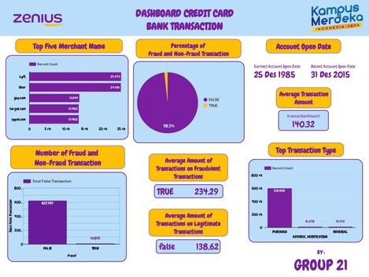
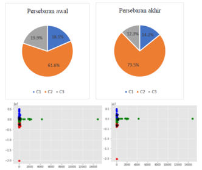

## Portfolio

---

### Data Analysis Project

[Bank Credit Card Transaction Fraud Detection](https://bit.ly/3c9M9py)
In this final project, my team and I did Fraud Understanding, Explatory Data Analysis, Dashboarding and Regression Modelling on Bank Credit Card Transaction dataset.

---
[Data Science Use Case in the Health Industry](/pdf/use_case.pdf) 
I found an example of data science use case in the health industry. In this case, used K-means Clustering to find out how to group the hospitalization rates by the patient's disease rate.

---

### Data Analysis Assignment

- [Python Structure & Data Type Assignment](https://bit.ly/3IHYwWc)
- [Loop, Conditional Statement & Function Assignment](https://bit.ly/3B0vdw7)
- [Missing Values Checking, Categorical Data Encoding, Anomalies and Outlier Handling Assignment](https://bit.ly/3c9BtHs)
- [Python for Data Analysis: Data Preprocessing with Pandas Assignment](https://bit.ly/3cn82Sj)
- [Data Visualization Study Case](/pdf/study_case.pdf)
- [Probability and Statistics Assignment](https://bit.ly/3AYsKCA)
- [Advanced Regression Techniques Assignment](https://bit.ly/3OcJk4r)

---

Page template forked from <a href="https://github.com/evanca/quick-portfolio">evanca</a>

<!-- Remove above link if you don't want to attibute -->
